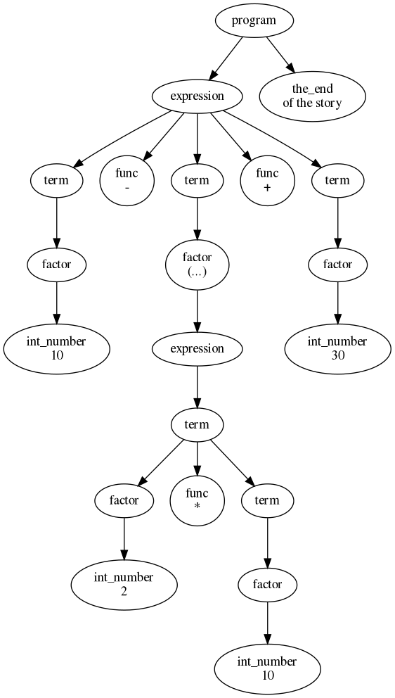

# Intro to onek-parser

*onek-parser* is a minimalistic backtracking recursive descent parser. Its input is kind of C++ compatible EBNF and it generates an AST directly in memory without intermediate code generation.

*"onek"* stands for *"this program/library is made with less than 1000 lines of code"*

```
                                CURRENT DEVELOPMENT STATUS: WORK IN PROGRESS
```

The motivation for writing this code was my experience with Boost Spirit, which is too complicated for my taste and with 140,000 lines of code to havy to include in some projects. Onek combines mini parsers to create bigger parsers.

The main difference between onek-parser and other parsers are: 

- left recursion needs to be transformed into right recursion but the program will remain left associative unless special provision are taken outside of the grammar.
- onek-parser uses generic tokens that can be parameterised with strings. For most purposes the list of tokens does not need to be adapted to each language parsed.

# The grammar

Here is a grammar for an arithmetic expression evaluator written in C++.
```
        // we need these palceholders to deal with right recursive productions.
        // left recursive productions are forbidden.

        auto p_expr = onek::make_arena_ptr<C>(handle, "expr");
        auto p_term = onek::make_arena_ptr<C>(handle, "term");

        // following rules contain right recursion but you can see in the following ast graph that
        // this does not result in right associativity. onek-parser creats these graphviz diagrams automatically

        auto sub_expr = ( open("(") >> p_exp >> close(")")          )->name(handle, "sub_expr");
        auto ufactor =  ( int_number() | float_number() | sub_expr  )->name(handle, "ufactor");
        auto factor =   (-prefix_op("-") >> ufactor                 )->name(handle, "factor")->action(handle, unary_op_action);
        auto term_x =   ( factor >> *(infix_op("*", "/") >> p_term) )->name(handle, "term_x");
        auto term =     ( clone(term_x)                             )->name(handle, "term")->action(handle, arithmetic_op_action);
        auto expr_x =   ( term >> *(infix_op("+", "-") >> p_expr_x) )->name(handle, "expr_x");
        auto expr =     ( clone(expr_x)                             )->name(handle, "expr")->action(handle, arithmetic_op_action);
        auto program =  ( expression >> the_end()                   )->name(handle, "program", true);

        p_expr->copy_bahaviour(expr);
        p_term->copy_bahaviour(term);
```

# The Abstract Syntax Tree

This grammar applied to the expression "10 - (2 * 10) + 30" will create following AST graph. Note that you can add a name to every production. This name will be shown in the ast graph. The AST can also be executed and in that case, the actions you attach to the nodes will be triggered when their corresponding node is visited.



As you can see the sub-nodes are flattend agains those nodes that are bound to an action. The actions interpret the code and are easy to write as they travers the children of the action node linearly. For right associative operators they need to traverse those sub-nodes in reverse order.

# The Action Function

In the above grammar, the action `arithmetic_op_action` is bound to expressions and terms. When executing an ast, the actions are triggered and they iterate through the child nodes of their parent node. The user needs to perform these iterations himself, see following example

```
    V arithmetic_op_action(N const &node) noexcept {
        N *left = node.first_child_;
        long left_value = std::get<long>(left->action());
        long sum = left_value;

        while (true) {
            N *middle = left->next_sibbling_;
            if (!middle)
                break;
            N *right = middle->next_sibbling_;
            if (!right)
                std::cerr << "programming error: expecting another sibbling child after:"
                          << middle->name_ << std::endl;
            long right_value = std::get<long>(right->action());
            char op = std::get<char>(middle->action());
            if (op == '+')
                sum += right_value;
            else if (op == '-')
                sum -= right_value;
            else if (op == '*')
                sum *= right_value;
            else if (op == '/')
                sum /= right_value;
            left = right;
        }
        return {sum};
    }
```

# EBNF Grammar vs onek-parser
```
   |     EBNF       |    onek-parser       |
   |----------------|----------------------|
   |   a   b        |       a >> b         |
   |  (a   b)+      |     +(a >> b)        |
   |  (a   b)*      |     *(a >> b)        |
   |  (a   b){0,1}  |     -(a >> b)        |
   |  (a   b){3,7}  | (a >> b).repeat(3,7) |
   |   a | b        |       a |  b         |
```

# Conclusion

To use the *onek-parser* you need to write grammars and actions and very occasionally adapt tokens (some languages allow hyphens in names and others not for e.g.). If you need to change the code, you can easily do so as this project consists of less than thousand lines of code (not counting test code and error reporting.

